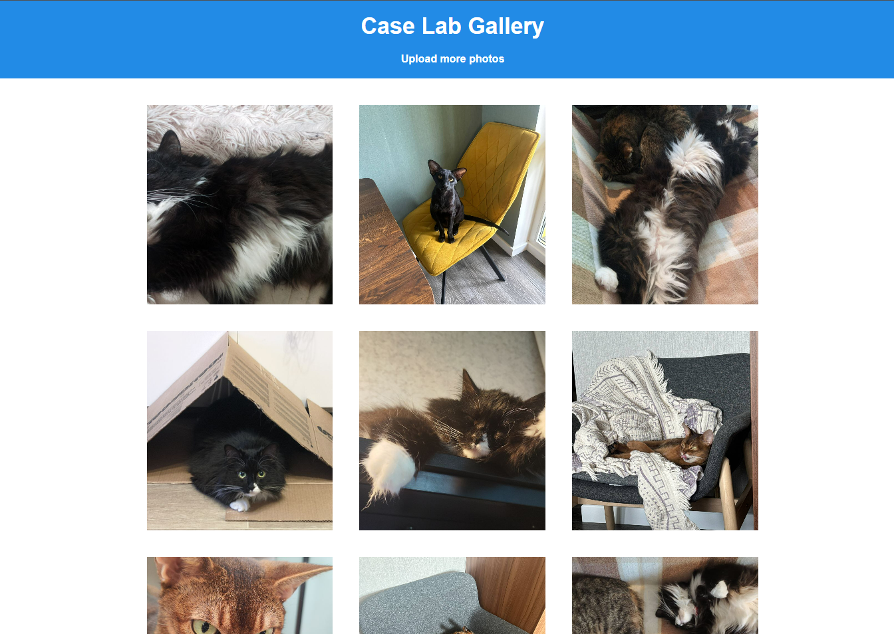
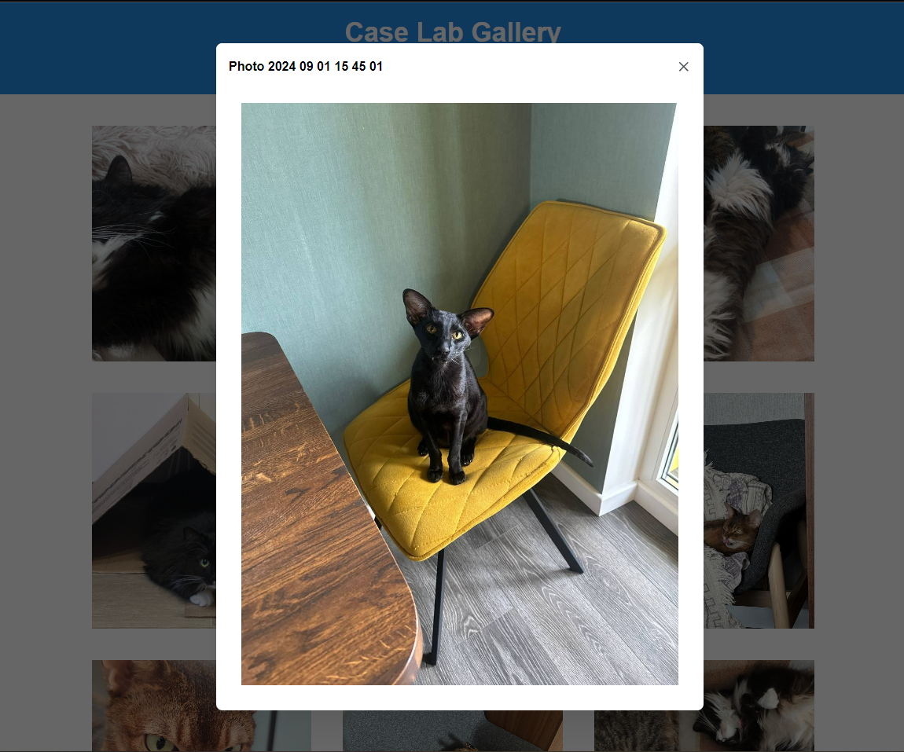

# Case Lab Gallery

## A. Мое решение:

Используемые инструменты:

1. Vite
2. React, react router, MobX
3. Mantine
4. Docker, ngnix
5. Directus
6. Eslint, prettier

Проблемы с которыми столкнулась:

- Самая большая проблема - проблема CORS при запросах к бэкенду. Моим решением было сделать прокси-сервер с помощью ngnix.
  Я первый раз работала с докером и ngnix, но тем не менее мне удалось решить мою проблему с CORS 🤓
- MobX. Обычно использовала RTK, так что тоже долго провозилась с новым стейт-менеджером и не успела сделать нормальный роутинг 😢

C самим React'ом никаких проблем не было, хотя жалко, что надо было писать на JS, а не на TS

## B. Установка проекта:

Сначала убедитесь, что у вас установлен и запущен Docker.
Если у вас не установлен докер, то его нужно скачать и установить с оф.сайта.

После запуска докера нужно открыть проект локально и ввести в терминале вашей IDE следующие команды:

```js
npm install
docker build -t cors .
cd directus
docker compose -f docker-compose.yml -p cors up
docker run -p "80:80" cors
```

Данные для входа в админку:
EMAIL: "admin@example.com"
PASSWORD: "d1r3ctu5"

## Скриншоты работающего приложения:




